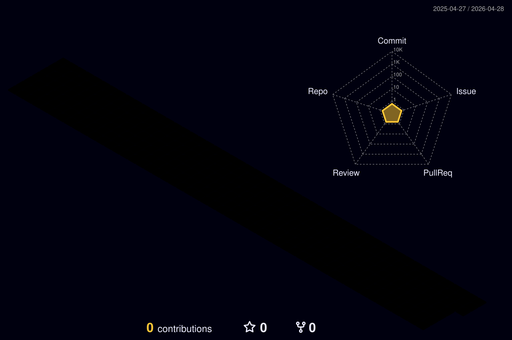

<div align="center">
  
# 👋 Hey, I'm Einfach-Mxrc

### 🚀 Developer | Creator | Problem Solver


</div>

---

## 🧑‍💻 About Me

```typescript
const developer = {
    name: "Marc",
    role: "Software Developer",
    location: "Germany 🇩🇪",
    interests: ["Web Development", "Automation", "System Design"],
    currentFocus: "Building scalable applications and exploring new technologies",
    learning: ["Cloud Architecture", "DevOps", "AI/ML"],
    funFact: "I debug with console.log() and I'm not ashamed 😎"
};
```

---

## 🛠️ Tech Stack

### Languages


### Frameworks & Libraries


### Tools & Platforms


---

## 📊 GitHub Stats

<div align="center">
  


</div>

<div align="center">
  


</div>

---

## 🎯 Featured Projects

<div align="center">

| Project | Description | Tech Stack |
|---------|-------------|------------|
| 🚀 **[Project Alpha](#)** | Advanced automation tool for development workflows | Python, Docker, CI/CD |
| 🌐 **[WebApp Pro](#)** | Modern full-stack web application with real-time features | React, Node.js, MongoDB |
| 🤖 **[Bot Framework](#)** | Customizable bot framework for Discord/Telegram | TypeScript, APIs |
| 🔧 **[DevTools Suite](#)** | Collection of developer productivity tools | Various |

</div>

> 📌 *More projects coming soon! Check back later or explore my repositories below.*

---

## 📈 Contribution Activity

<div align="center">



</div>

## 📊 Activity Graph

[](https://github.com/ashutosh00710/github-readme-activity-graph)

---

## 🏆 GitHub Trophies

<div align="center">

[](https://github.com/ryo-ma/github-profile-trophy)

</div>

---

## 💡 Random Dev Quote

<div align="center">


</div>

---

## 🤝 Connect With Me

<div align="center">

[](https://github.com/Einfach-Mxrc)
[](https://discord.com)
[](mailto:admin@mxrc.club)

</div>

---

<div align="center">
  
### 💼 Open for Collaborations

I'm always interested in working on innovative projects and contributing to open source.  
Feel free to reach out if you want to build something amazing together! 🚀

---


⭐️ From [Einfach-Mxrc](https://github.com/Einfach-Mxrc)

</div>
